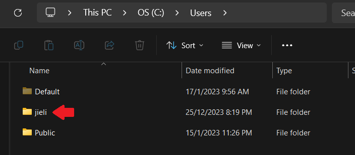

Configuration:

1. `build.grader.kts` file: change `compileSdk` to ***34***
```kotlin

//...code

android {
    namespace = "com.hotel_booking_systems_android"
    compileSdk = 34 //please change to 34

    //code...
}

val room_version = "2.5.2"
val navigation_version = "2.7.4"

dependencies {
    //code...
}

```

2. `local.properties` file: change path
> you can find your computer username in path: C://Users/



```properties
sdk.dir=C\:\\Users\\<your computer username>\\AppData\\Local\\Android\\Sdk
#example: sdk.dir=C\:\\Users\\jieli\\AppData\\Local\\Android\\Sdk
```
